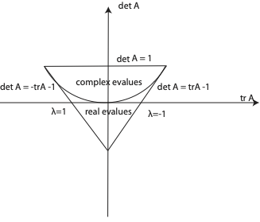

In this chapter we generalise the previous approach by considering the population dynamics of two interacting populations.

## A general model of two interacting species in discrete time

Let $N_t$ and $P_t$ represent population densities at time $t$ where $t$ is a discrete variable. We will consider systems that can be written as a system of 2 difference equations of the form,
$$
\begin{aligned}
N_{t+1}=f(N_t,P_t), \nonumber \\
P_{t+1}=g(N_t,P_t).
\end{aligned}
$$ {#eq-discretetimetwovar}
where the population dynamics of the species are coupled to one another via the functions $f$ and $g$.

The precise form for $f$ and $g$ will be defined by the biological system we study. Typical inter-population interactions that are studied are: predator prey models, competition and cooperation.


## General techniques for analysing coupled  first order difference equations

### Fixed points and linear stability

The fixed points of @eq-discretetimetwovar $(N^*,P^*)$ satisfy
$$
\begin{aligned}
N^*=g(N^*,P^*) \nonumber \\
P^*=f(N^*,P^*).
\end{aligned}
$$ {#eq-noLabel}

<!--
Identify the fixed points of the model
\begin{aligned}
N_{t+1}&=P_t \\
P_{t+1}&=N_t+P_t.
\end{aligned}
}

\stwritingexample{
Fixed points satisfy
\begin{aligned}
N^*&=P^* \\
P^*&=N^*+P^*.
\end{aligned}
Thus the only fixed point is (0,0).
-->

To consider the linear stability of a steady state we consider the change of variables,
$$
\begin{aligned}
N_t&=N^*+\hat{N}_{t},   \nonumber\\
P_t&=P^*+\hat{P}_{t},  \nonumber
\end{aligned}
$$ {#eq-noLabel}
where we can collect the perturbations into a vector,
$$
\hat{\phi}_t = \left( \begin{array}{c} \hat{N}_{t} \\ \hat{P}_{t}\end{array} \right).
$$ {#eq-noLabel}
After substitution into @eq-discretetimetwovar and performing a Taylor expansion about $(N^*,P^*)$,
$$
\hat{\phi}_{t+1} = J \hat{\phi}_t + \mathcal{O}\left(\|\hat{\phi}_t \|^2\right).
$$ {#eq-nolabel}
If we assume that $\hat{N}$ and $\hat{P}$ are both small then we can consider this equation to linear (leading) order,
$$
\hat{\phi}_{t+1} = J \hat{\phi}_t,
$$ {#eq-discretetimesecondorderdiff}
where the matrix $J$ is the familiar Jacobian matrix,
$$
J = \left.\left(\begin{array}{rr}
\frac{\partial f}{\partial N}&\frac{\partial f}{\partial P} \\ \frac{\partial g}{\partial N }&\frac{\partial g}{\partial P} \end{array}\right)\right|_{(N^*,P^*)}.
$$ {#eq-noLabel}
By solving this linear system we can investigate whether small perturbation about the fixed point grow or decay in magnitude as time evolves and hence determine the linear stability of the fixed point.

The solution of @eq-discretetimesecondorderdiff takes the form,
$$
\hat{\phi}_t=\sum_{i=1}^2 C_i \lambda_i^t\mathbf{c}_i,
$$ {#eq-noLabel}
where  the $C_i$'s are constants determined by initial conditions and the $\lambda_i$'s and $\mathbf{c}_i$'s are the eigenvalues and eigenvectors of $J$, respectively. From this form we can split into three cases:

- $|\lambda_i|<1\ \ \ \forall i$, the fixed point is *linearly stable*,
- $\exists \; i \; s.t. \; |\lambda_i|>1\ \ $, the fixed point is **linearly unstable** to perturbations,
- $|\lambda_i|=1\ \ \ \forall i$, the fixed point is **marginal**, linear analysis is inconclusive and higher order terms $\mathcal{O}\left(\|\hat{\phi}_t \|^2\right)$ need to be considered.

###  Jury conditions 

In many cases it is not useful to explicitly compute the eigenvalues of the Jacobian matrix. In such cases we can employ the Jury conditions in order to determine when a fixed point is linearly stable.

Recall that for a two dimensional matrix $A$, the eigenvalues satisfy the quadratic characteristic equation
$$
\lambda^2- trA \lambda + detA=0.
$$ {#eq-noLabel}
The stability of the fixed is guaranteed if $|\lambda _i|<1$ $\forall i$.

Consider the characteristic equation,
$$
P(\lambda)=\lambda^2 + a \lambda +b=0,
$$ {#eq-noLabel}
where $a,b \in \Re$. Note that $a=-tr{A}$ and $b=\det{A}$.

The Jury conditions state that  $|\lambda_i |<1 \; \forall i$ if, and only if,

- $b<1$,
- $1+a+b>0$,
- $1-a+b>0$.

See @fig-juryconditions for a schematic diagram.

{#fig-juryconditions}

### Proof of the Jury conditions

The roots of $P(\lambda)$ are
$$
\lambda_{1,2}=\frac{-a \pm \sqrt{a^2-4b}}{2}.
$$ {#eq-noLabel}

### Complex roots 

Suppose $a^2-4b< 0$. 
The roots are complex. Since $b$ is equal to the product of the roots, we find that 

$$
b=\lambda_1\lambda_2 = |\lambda_1|^2 = |\lambda_2^2|.
$$ {#eq-noLabel}
Hence $\lambda_i<1$ $\forall \ \ i$ if and only if $b<1$.


For the other conditions we introduce the identity:
$$
a^2-4b=(|a|-2)^2 - 4(1+b-|a|).
$$ {#eq-noLabel}
Therefore, when $a^2-4b<0$, the inequality requires
$$
(|a|-2)^2 - 4(1+b-|a|)<0.
$$ {#eq-noLabel}
This can only occur if
$$
1+b-|a| >0 \implies 1+b-a>0 \ \ \textrm{and} \ \  1+b+a>0.
$$ {#eq-noLabel}


###  Real roots 
Suppose $a^2-4b\geq 0$

The largest magnitude of the roots
is
$$
R=\max\{|\lambda_1|,|\lambda_2|\} =  \frac{|a| + \sqrt{a^2-4b}}{2}.
$$ {#eq-noLabel}
This is an increasing function of $|a|$. 

$R=1$
$$
\implies  \frac{|a| + \sqrt{a^2-4b}}{2}=1
\implies |a|-2=-\sqrt{|a|^2-4b}
\implies |a|^2-4|a|+4=|a|^2-4b 
\implies |a|=b+1.
$$ {#eq-noLabel}
Hence $0\leq R < 1$ if and only if $0\leq |a|<1+b$. Also, since $|\lambda_i|<1 \forall i$ implies that $|\lambda_1\lambda_2|<1$, it follows that $|b|<1$ must hold.


<!--
\begin{figure}
\centering
\subfigure{\includegraphics[scale=1.0]{JuryConditions2D.eps}}
\caption{Application of the Jury conditions for a two variable model.}
\label{JuryConditions}
\end{figure}
-->

<!--Suppose a linear stability analysis of some fixed point yields the Jacobian matrix
$$
A= \left(\begin{array}{cc}
1 & 0 \\0&r  \end{array}\right).
$$ {#eq-noLabel}
where $r\in\Re^+$.
Use the Jury conditions to determine whether or not the fixed point is linearly stable.
The characteristic equation is
$$
\lambda^2 -\lambda(1+r) + r=0.
$$ {#eq-noLabel}
Hence in this case $a=-(1+r)$, $b=r$.
$$
b<1 \implies r< 1 \implies 
$$ {#eq-noLabel}
-->

## Host Parasitoid infection

Parasitoids are creatures that have a free living and parasitic stage. The free-living adult lays eggs in a host that later hatch and develop after eating the host. The discrete stages of the parasitoids life cycle and the dependence on its reproduction on the availability of host suggest a discrete time, multi species models. Let $N_{t}$ and $P_t$ represent the number of hosts and parasitoids at time $t$, respectively. Let $R_0$ represent the reproductive ratio of host in the absence of parasites and $C$ the average number of viable eggs laid by each parasite on a host.

###  Model  equations 

We consider equations of the form
$$
\begin{aligned}
N_{t+1}&=R_0N_t f(N_t,P_t), \nonumber \\
P_{t+1}&=CN_t (1- f(N_t,P_t)). \nonumber
\end{aligned}
$${#eq-discretetimetwovar}

The justification for this form is that at a given time $t$ there are $N_t$ hosts. A total of $N_t f(N_t,P_t)$ escape the parasite and are able to reproduce whilst a total of $N_t(1-f(N_t,P_t))$ do not escape the parasite and lead to parasitic reproduction at the next time step.  


Choosing 
$$
f(N_t,P_t)=e^{-aP_t},
$$ {#eq-noLabel}
yields the Nicholson Bailey model
$$
\begin{aligned}
N_{t+1}=R_0N_t e^{-aP_t}, \nonumber \\
P_{t+1}=CN_t (1- e^{-aP_t}). 
\end{aligned}
$$ {#eq-nichbail}


<!--
Show that in the limit of small parasite numbers the parasite equation can be approximated by
$$
P_{t+1}=CaN_t P_t. %(1- e^{-aP_t}). 
$$ {#eq-noLabel}
Also show that has parasite number get very large the parasite equation can be approximated by
$$
P_{t+1}=CN_t. %(1- e^{-aP_t}). 
$$ {#eq-noLabel}


Taylor expanding the exponential yields at leading order
$$
P_{t+1}=CaN_t P_t. %(1- e^{-aP_t}). 
$$ {#eq-noLabel}
In the limit of small parasite population the per capita growth rate is proportional to $N_t$. 
\\
Taking the limit $P_t\rightarrow \infty$ yields
$$
P_{t+1}=CN_t. %(1- e^{-aP_t}). 
$$ {#eq-noLabel}
The population dynamics are approximately independent of parasite population.

-->

### Numerical solution
```{python}
#| label: fig-plotNicolsonBailey
#| fig-cap: "A plot of the Nicholson Bailey model solution."
import numpy as np
import matplotlib.pyplot as plt
# This code solve the Nicholson Bailry model

# Discretise time
T=100
t = np.arange(0, T, 1)

# Define parameters
R_0=1.5
C=3.7
a=1.7

# Define initial data
N_0=[1.5, 0.1]

# Define rhs of NIch Bailey model
def rhsNicholsonBailey(x,par):
  N=x[0]
  P=x[1]

  R_0=par[0]
  C=par[1]
  a=par[2]

  # Generate empty vector
  g=np.zeros_like(x,dtype=float)

  # Encode rhs of N Bailry model
  f=np.exp(-a*P)
  g[0]=R_0*N*f
  g[1]=C*N*(1-f)
 
  return g

# Gen solver for solving Two pop Model
def SolveTwoPopDiff(t,rhs,N_0,par):
  # Define solution vectors
  N = np.zeros_like(t,dtype=float)
  P=  np.zeros_like(t,dtype=float) 
  # Make 0th entry the initial data
  N[0]=N_0[0]
  P[0]=N_0[1]

  # Loop over time
  for i in t:
    if i>0:

      rhs_eval=rhs([N[i-1],P[i-1]],par)
      N[i]=rhs_eval[0]
      P[i]=rhs_eval[1] 

  return N,P

# Solve Nicholson Bailey model
N,P=SolveTwoPopDiff(t,rhsNicholsonBailey,N_0,[R_0,C,a])

# Plot results
fig, ax = plt.subplots(1,2)
ax[0].plot(t, N, linestyle='-', alpha=0.4)
ax[0].plot(t, N, linestyle='None', marker='o', color='C0')
ax[0].set_xlabel('$t$')
ax[0].set_ylabel('$N_t$')
ax[0].set_ylim([0,100])

ax[1].plot(t, P, linestyle='-', alpha=0.4)
ax[1].plot(t, P, linestyle='None', marker='o', color='C0')
ax[1].set_xlabel('$t$')
ax[1].set_ylabel('$P_t$')
plt.tight_layout()
plt.show()
```

::: {#fig-nichbaileymodel}

```{shinylive-python}
#| standalone: true
#| components: [viewer]
#| viewerHeight: 750


from shiny import App, Inputs, Outputs, Session, render, ui
from shiny import reactive

import numpy as np
from pathlib import Path
import matplotlib.pyplot as plt
from scipy.integrate import odeint

app_ui = ui.page_fluid(
    ui.layout_sidebar(
        ui.sidebar(
    ui.input_slider(id="R_0",label="R_0",min=0.0,max=5.0,value=1.2,step=0.001), 
    ui.input_slider(id="a",label="a",min=0.0,max=5.0,value=1.2,step=0.001),    
     ui.input_slider(id="C",label="C",min=0.0,max=5.0,value=1.2,step=0.001),           
    ui.input_slider(id="N_0",label="N_0 (Initial condition)",min=0.0,max=4.0,value=0.5,step=0.01),
    ui.input_slider(id="P_0",label="P_0 (Initial condition)",min=0.0,max=4.0,value=0.5,step=0.01),
    ui.input_slider(id="T",label="Number of iterations",min=0.0,max=60.0,value=20.0,step=1.0),
    
       
        ),

        ui.output_plot("plot"),
    ),
)

def server(input, output, session):
    
    @render.plot
    def plot():
        fig, ax = plt.subplots()
        #ax.set_ylim([-2, 2])
        # Filter fata
        
        
        R_0=float(input.R_0())
        a=float(input.a())
        C=float(input.C())
        T=int(input.T())
        N_0=float(input.N_0())
        P_0=float(input.P_0())

        par=[R_0,a,C]
        init_cond=[N_0,P_0]

        def nicholsonbaileyrhs(x,par):
          f=np.zeros_like(x,dtype=float)
          N=x[0]
          P=x[1]

          R_0=par[0]
          a=par[1]
          C=par[2]

          f_nb=np.exp(-a*P)

          f[0]=R_0*N*f_nb
          f[1]=C*N*(1-f_nb)

          return f
        # Define rhs of logistic map 
     
        # this function computes the solutio to the difference equation. It also stores solution in format for cobweb plotting
        def SolveSingleDiffAndCobweb(t,rhs,init_cond,par):
          # Initialise solution vector
          N = np.zeros_like(t,dtype=float)
          P = np.zeros_like(t,dtype=float)

          N[0]=init_cond[0]
          P[0]=init_cond[1]

          # loop over time and compute solution.
          for i in t:
            if i>0:
              sol=[N[i-1],P[i-1]]
              rhs_eval=rhs(sol,par)
              N[i]=rhs_eval[0]
              P[i]=rhs_eval[1]

 
          return N, P

        # Define discretised t domain
        t = np.arange(0, T, 1)
        # define initial conditions
        
        # Compute numerical solution of ODEs
        N,P = SolveSingleDiffAndCobweb(t,nicholsonbaileyrhs,init_cond,par)

        # Plot results
        
        ax.plot(t,N,t,P,linestyle='-',alpha=0.4)
        ax.plot(t,N,t,P,linestyle='None',marker='o')
        ax.set_xlabel('$t$')
        ax.legend(['$N_t$','$P_t$'])
        #ax.set_ylim([0,max_sol])
        ax.set_title('Time series')
      

        plt.grid()

        plt.show()
    
app = App(app_ui, server)
```

An app to explore  behaviour in the Nicholson Bailey model.
:::


###  Fixed points 

The fixed points satisfy
$$
\begin{aligned}
N^*=R_0N^*e^{-aP^*}, \nonumber \\
P^*=CN^* (1- e^{-aP^*}). 
\end{aligned}
$$ {#eq-noLabel}

The first equation yields
$$
N^*=0.
$$ {#eq-noLabel}

Suppose $N^*\neq 0$
$$
1=R_0e^{-aP^*}.
$$ {#eq-noLabel}

Hence
$$
P^*=\frac{1}{a}\ln R_0.
$$ {#eq-noLabel}

Consider the second equation.
Suppose $N^*=0$.
We obtain
$$
P^*=0. 
$$ {#eq-noLabel}
Hence one fixed point is $(0,0)$.

Suppose $P^*=\frac{1}{a}\ln R_0$.
$$
\frac{1}{a}\ln R_0 = CN^*(1-\frac{1}{R_0}).
$$ {#eq-noLabel}
Hence
$$
N^* = \frac{\frac{1}{a}\ln R_0 }{C(1-\frac{1}{R_0})} = \frac{R_0\ln R_0 }{aC(R_0-1)}.
$$ {#eq-noLabel}
Hence the second fixed point is
$$
\left(\frac{R_0\ln R_0 }{aC(R_0-1)},\frac{1}{a} \ln R_0 \right).
$$ {#eq-noLabel}

We can verify by substitution that 
$$
\left(\frac{R_0\ln R_0 }{aC(R_0-1)},\frac{1}{a} \ln R_0 \right).
$$ {#eq-noLabel}
is a fixed point. We can then deduce a condition on the model parameters that must hold in order that the fixed point is biologically relevant.


To verify by substitution we substitute the proposed solution into the governing equations. 
Note that
$$
e^{-aP^*}=\frac{1}{R_0}.
$$ {#eq-noLabel}
In this case
$$
\begin{aligned}
\frac{R_0\ln R_0 }{aC(R_0-1)}=R_0 \frac{R_0\ln R_0 }{aC(R_0-1)}\frac{1}{R_0}, \nonumber \\
\frac{1}{a} \ln R_0=C\frac{R_0\ln R_0 }{aC(R_0-1)} (1-\frac{1}{R_0}). 
\end{aligned}
$$ {#eq-nichbail}

Cancellation shows that both equations hold. Hence the fixed point is a valid fixed point.
To be biologically relevant we require that both components of the solution are real and positive. In this case this leads to the condition $R_0>1$}.

### Linear stability  

The Jacobian matrix is given by
$$
A_{(N_t,P_t)}= \left(\begin{array}{cc}
R_0e^{-aP_t}&-R_0aN_te^{-aP_t} \\ c(1-e^{-aP_t})&aCN_te^{-aP_t} \end{array}\right).
$$ {#eq-noLabel}

###  Linear stability of the trivial fixed point  

Evaluating at (0,0) yields
$$
A= \left(\begin{array}{cc}
R_0 & 0 \\ 0 & 0 \end{array}\right).
$$ {#eq-noLabel}
Hence the eigenvalues are $R_0$ and 0. 
 If $0<R_0<1$ (0,0) is stable whilst if $R_0>1$ (0,0) is unstable.

 
###  Linear stability of the nontrivial fixed point  


We can show  that the Jacobian matrix evaluated at  the nontrivial fixed point can be written as
$$
A= \left(\begin{array}{cc}
1&-\frac{R_0 \ln R_0}{c(R_0-1)} \\ c(1-\frac{1}{R_0})&\frac{\ln R_0}{R_0-1} \end{array}\right) .
$$ {#eq-noLabel}
and deduce that the eigenvalues of A satisfy the characteristic polynomial
$$
\lambda^2 - \lambda\left(1+\frac{\ln R_0}{R_0-1}\right)+ \frac{R_0\ln(R_0)}{R_0-1}=0.
$$ {#eq-noLabel}


### Employing the Jury conditions 
To proceed with linear stability analysis we employ the Jury conditions.
Consider the polynomial
$$
\lambda^2+a\lambda+b=0,
$$ {#eq-noLabel}
In our case 
$$
a= - (1+\frac{\ln R_0}{R_0-1}) 
$$ {#eq-noLabel}
and
$$
b=\frac{R_0\ln(R_0)}{R_0-1}.
$$ {#eq-noLabel}


The third Jury condition ($b<1$) implies that for linear stability
$$
\ln R_0 < 1-\frac{1}{R_0}.
$$ {#eq-noLabel}
To demonstrate that this inequality is  not true for $R_0>1$, let $f_1=\ln R_0$ and $f_2=1- 1/R_0$. When $R_0=1$, $f_1=f_2=0$. However, 
$$
f_1'=\frac{1}{R_0}  \ \ \textrm{and} \ \ f_2'=\frac{1}{R_0^2},
$$  {#eq-noLabel}
 implies 
$$
f_1'>f_2'  \ \ \forall \ R_0>1.
$$ {#eq-noLabel}
Hence
$$
\ln R_0 > 1-\frac{1}{R_0}.
$$ {#eq-noLabel}
Hence the fixed point is unstable if $R_0>1$. 


### Symbolic calculations in Python

Below sympy is used to identify the fixed points. The Jacobian matrix is then computed and evaluated at the fixed points.  

```{python}
#| label: code-nich_bailery
#| fig-cap: "Symbolic calculations"
#| code-fold: True
#| caption: none


import numpy as np
import sympy as sp


# Define variables and constants
R_0=sp.symbols("R_0",real=True,nonnegative=True)
a=sp.symbols("a",real=True,nonnegative=True)
C=sp.symbols("C",real=True,nonnegative=True)

N = sp.symbols("N",real=True,nonnegative=True)
P = sp.symbols("P",real=True,nonnegative=True)

# Define H
H_1=R_0*N*sp.exp(-a*P)
H_2=C*N*(1-sp.exp(-a*P))

# Solve the FP equation
fp=sp.solve([H_1-N,H_2-P],[N,P],dict=True)

print("The FPs are:")
print(fp[0])
print(fp[1])

# Compute the Jacobian
A=sp.Array( [[H_1.diff(N), H_1.diff(P)],[H_2.diff(N), H_2.diff(P)]])

print("The Jacobian of H is:")
print(sp.simplify(A))


# Evaluate derivative

print("The Jacobian evaluated at FP 0 is:")
sol0_N=fp[0][N]
sol0_P=fp[0][P]

A_eval_0=A.subs([(N,sol0_N),(P,sol0_P)])
print(A_eval_0)

print("The Jacobian evaluated at FP 1 is:")
sol1_N=fp[1][N]
sol1_P=fp[1][P]

A_eval_1=A.subs([(N,sol1_N),(P,sol1_P)])
print(A_eval_1)


```